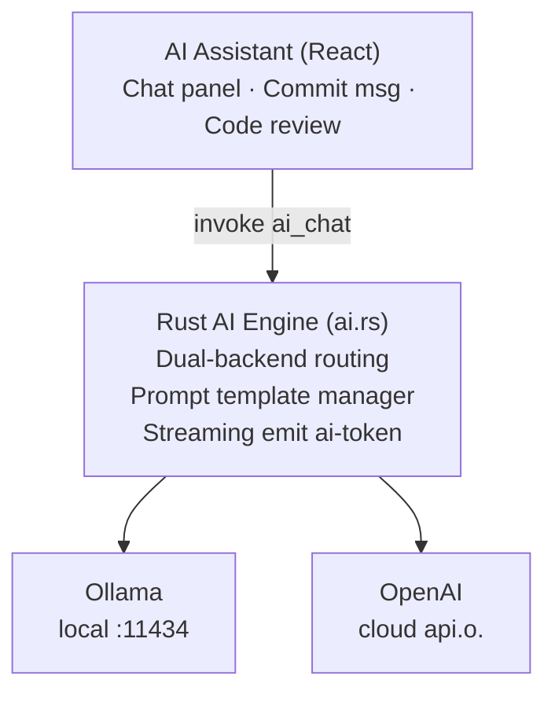

# AI Integration Design

## Architecture



## Dual-Backend Configuration

```rust
// src-tauri/src/ai/mod.rs
pub enum AIBackend {
    Ollama {
        endpoint: String,       // default: http://localhost:11434
        model: String,          // default: codellama:7b
    },
    OpenAI {
        api_key: String,        // read from tauri-plugin-store
        model: String,          // default: gpt-4o-mini
    },
}

pub struct AIConfig {
    pub backend: AIBackend,
    pub system_prompt: String,
    pub max_tokens: u32,
    pub temperature: f32,
}
```

## IPC Flow

```
Frontend invoke("ai_chat", messages)
    → Rust routes to Ollama or OpenAI based on config
    → Streams response token-by-token via emit("ai-token")
    → Frontend listens and appends tokens to chat UI
```

Settings and API keys are persisted through `tauri-plugin-store` with file-level encryption.

## Feature Scenarios

### 1. Commit Message Generation

```
Trigger: User is ready to commit (staged changes exist)
Input: Output of git diff --staged
Prompt template:

You are a Git commit message generator.
Based on the following code changes, generate a concise commit message
following the Conventional Commits specification (feat/fix/docs/refactor/test/chore).

Changes:
{diff_content}

Output only the commit message, without additional explanation.
```

### 2. Code Review

```
Trigger: User clicks "AI Review" on the commit detail page
Input: Full diff of the selected commit
Prompt template:

Please review the following code changes, focusing on:
1. Potential bugs or logic errors
2. Security risks
3. Performance issues
4. Code style and quality

Changes:
{diff_content}

Output as a list, with severity labels (High/Medium/Low).
```

### 3. Repository Q&A

```
User freely asks questions; AI answers based on repository context.

System prompt:
You are a Git repository analysis assistant. The user is using the GitBanshee
visualization tool. You have access to the following repository information:
- Current branch: {current_branch}
- Recent commits: {recent_commits}
- Repository path: {repo_path}

Help the user understand the structure and history of the codebase.
```

### 4. Branch Naming Suggestions

```
Trigger: User is creating a new branch
Input: Uncommitted changes relative to the current branch
Output: 2-3 suggested branch names
```

## Security Design

| Aspect | Approach |
|--------|----------|
| API Key storage | `tauri-plugin-store` with file-level encryption |
| Prompt injection prevention | Constraints in system prompt, length + content filtering on user input |
| Local model isolation | Ollama called via localhost HTTP, no network required |
| User awareness | Show the data scope being sent before each AI call |
| Disable toggle | AI functionality can be fully disabled in settings |

## Model Recommendations

Check the latest models available on each platform. General guidance:

| Scenario | Local preference | Cloud preference |
|----------|-----------------|------------------|
| Commit message gen | Code-focused 7B+ model | Lightweight API (gpt-4o-mini tier) |
| Code review | Strong code reasoning model | Mid-tier (claude-3-haiku / gpt-4o tier) |
| Repository Q&A | General-purpose 7B+ model | Full capability (gpt-4o / claude-3.5-sonnet tier) |
| Branch naming | Code-focused 7B+ model | Lightweight API |
