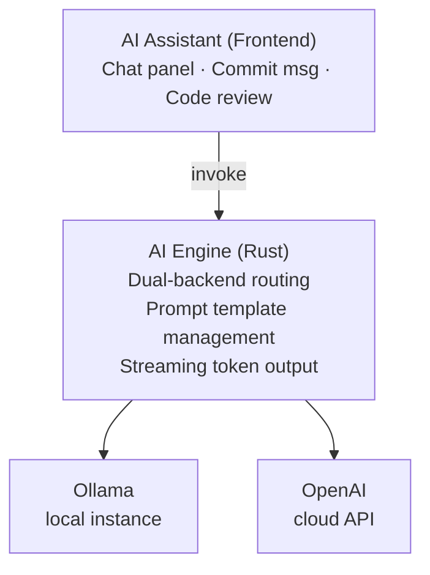

# AI Integration Design

## Architecture

## Dual-Backend Strategy

The AI engine supports two interchangeable backends selected by user configuration:

- **Ollama** — local deployment via the Ollama API. Runs entirely offline, no data leaves the machine. Suitable for privacy-sensitive workflows or environments without internet access.
- **OpenAI** — cloud API with stronger models for complex reasoning tasks. Requires an API key stored in encrypted local storage.

Both backends share the same interface, so switching between them requires only a settings change — no frontend code changes needed. Configuration fields include endpoint URL, model name, system prompt, token limit, and temperature.

## IPC Flow

Frontend invokes → Rust routes to the chosen backend → backend streams tokens → Rust forwards as events → frontend appends to chat UI. Settings and API keys are persisted through Tauri's plugin store with file-level encryption.

## Feature Scenarios

### 1. Commit Message Generation

When the user has staged changes ready to commit, the AI reads the staged diff and generates a concise commit message following the Conventional Commits specification.

### 2. Code Review

On a selected commit, the AI reviews the full diff and identifies potential bugs, security risks, performance concerns, and code quality issues. Results are presented with severity labels.

### 3. Repository Q&A

The user asks natural-language questions about the repository. The AI receives contextual information (current branch, recent commits, repository path) to provide informed answers about codebase structure and history.

### 4. Branch Naming Suggestions

When creating a new branch, the AI analyzes the uncommitted changes and suggests 2–3 descriptive branch names.

## Security Design

| Aspect | Approach |
|--------|----------|
| API Key storage | Encrypted file-level storage via Tauri plugin store |
| Prompt injection prevention | System prompt constraints, input length limiting |
| Local model isolation | Ollama communicates over localhost only, no network required |
| User awareness | Data scope displayed before each AI call |
| Disable toggle | AI functionality can be fully disabled in settings |

## Model Recommendations

Specific model names should be determined at implementation time based on current availability. General guidance:

| Scenario | Local preference | Cloud preference |
|----------|-----------------|------------------|
| Commit message gen | Code-focused mid-size model | Lightweight API tier |
| Code review | Strong code reasoning model | Mid-tier API |
| Repository Q&A | General-purpose mid-size model | Full-capability tier |
| Branch naming | Code-focused mid-size model | Lightweight API tier |
