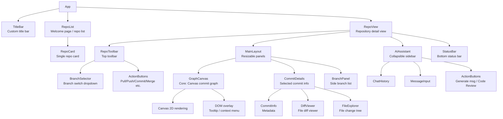
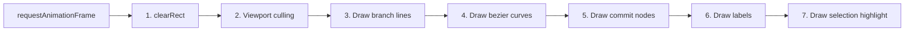

# Frontend Architecture

> See [architecture.md](architecture.md) for the full tech stack overview.

## Component Tree



## State Management (Zustand Stores)

```typescript
// src/stores/repoStore.ts
interface RepoState {
  // Repository info
  repoPath: string | null;
  repoInfo: RepoInfo | null;

  // Commit graph data
  commits: CommitNode[];
  totalCommits: number;
  isLoading: boolean;
  hasMore: boolean;

  // Selection state
  selectedCommit: CommitNode | null;
  hoveredCommit: CommitNode | null;

  // Branches
  branches: BranchInfo[];
  currentBranch: string;

  // Actions
  openRepo: (path: string) => Promise<void>;
  loadMoreCommits: () => Promise<void>;
  selectCommit: (hash: string) => Promise<void>;
  refreshBranches: () => Promise<void>;
  execGitOp: (op: GitOperation) => Promise<void>;
}

// src/stores/uiStore.ts
interface UIState {
  sidebarOpen: boolean;
  aiPanelOpen: boolean;
  panelWidths: { main: number; details: number };
  theme: 'light' | 'dark';
  graphSettings: {
    rowHeight: number;
    nodeRadius: number;
    showLabels: boolean;
  };
}
```

## IPC Patterns

### Command-style (invoke)

```typescript
// src/hooks/useGit.ts
import { invoke } from '@tauri-apps/api/core';

export function useGit() {
  const openRepo = async (path: string) => {
    const repo = await invoke<RepoInfo>('open_repo', { path });
    return repo;
  };

  const getCommits = async (offset: number, limit: number) => {
    const commits = await invoke<CommitNode[]>('get_commits', {
      repoPath: store.repoPath,
      offset,
      limit,
    });
    return commits;
  };

  const execOperation = async (op: GitOperation) => {
    const result = await invoke<ExecResult>('git_operation', { op });
    return result;
  };

  return { openRepo, getCommits, execOperation, ... };
}
```

### Event Listener (listen)

```typescript
// AI streaming response
import { listen } from '@tauri-apps/api/event';

useEffect(() => {
  const unlisten = await listen<string>('ai-token', (event) => {
    setResponse(prev => prev + event.payload);
  });
  return () => { unlisten(); };
}, []);

// Git operation progress
listen<ProgressPayload>('git-progress', (event) => {
  setProgress(event.payload.percent);
});
```

## GraphCanvas Component Design

```typescript
interface GraphCanvasProps {
  commits: CommitNode[];
  selectedHash: string | null;
  onSelect: (hash: string) => void;
  onLoadMore: () => void;
}

// Internal state
interface CanvasState {
  scale: number;        // Zoom level
  offsetX: number;      // Pan offset
  offsetY: number;
  viewportWidth: number;
  viewportHeight: number;
}
```

### Render Loop



1. clearRect
2. Compute visible commits (viewport culling)
3. Draw branch background lines
4. Draw connecting lines (bezier curves)
5. Draw commit nodes (circles)
6. Draw branch/tag labels
7. Draw selection highlight

## Theme System

Tailwind CSS dark mode + CSS variables for Canvas colors:

```css
:root {
  --graph-bg: #ffffff;
  --graph-line: #e0e0e0;
  --graph-node-border: #ffffff;
  --graph-text: #333333;
  --graph-selection-glow: rgba(66, 133, 244, 0.3);
}

.dark {
  --graph-bg: #1e1e1e;
  --graph-line: #333333;
  --graph-node-border: #1e1e1e;
  --graph-text: #cccccc;
  --graph-selection-glow: rgba(66, 133, 244, 0.2);
}
```

## Performance Considerations

| Scenario | Approach |
|----------|----------|
| Large repo first load | Incremental loading (500 commits initial), show skeleton UI |
| Large file diff | Render only visible lines + lightweight syntax highlighting |
| AI streaming response | Event-based token push, frontend appends to DOM |
| Many branches in panel | Virtual list via `@tanstack/react-virtual` |
