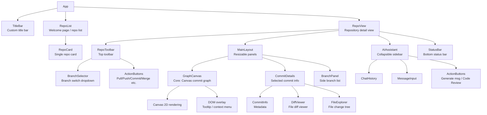

# Frontend Architecture

> See [architecture.md](architecture.md) for the full tech stack overview.

## Component Decomposition

## State Management

Two Zustand stores:

- **Repo store** — repository metadata, commit graph data, branch/tag lists, selection state, and Git-operation actions. Populated via Tauri IPC.
- **UI store** — panel visibility, layout ratios, theme preference, graph display settings. Persisted to local storage.

Data flow: Rust backend → IPC → Zustand store → React components → DOM/Canvas.

## IPC Patterns

Two patterns documented in [architecture.md](architecture.md): `invoke` for discrete operations (open repo, fetch commits, execute Git ops) and `listen` for streaming data (AI tokens, operation progress).

## GraphCanvas

See [graph-layout.md](graph-layout.md) for the lane assignment algorithm and WebGL + Canvas 2D hybrid rendering pipeline. See [theme-system.md](theme-system.md) for how graph colors stay in sync with the active theme.

## Performance Considerations

| Scenario | Approach |
|----------|----------|
| Large repo first load | Incremental loading, skeleton UI during fetch |
| Large file diff | Viewport-only line rendering, lightweight syntax coloring |
| AI streaming response | Event-based token push, frontend appends incrementally |
| Many branches in panel | Virtual list (windowing) |
