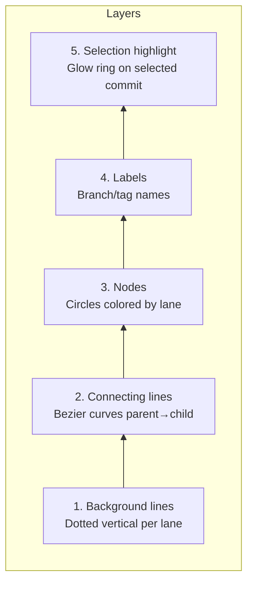

# Commit Graph Layout Algorithm

## Core Concept

A Git commit history is a **directed acyclic graph (DAG)**. Visualization maps this DAG onto a 2D grid:

- **Y-axis** — time / topological order (newer commits at top, older at bottom)
- **X-axis** — lanes, each active branch occupies one column

## Lane Assignment Algorithm

Inspired by Git's own `git log --graph` output, the algorithm processes commits in reverse topological order (newest first) and assigns each commit to a lane column. The core challenge is minimizing lane count while ensuring no two simultaneous branches overlap visually.

### Approach

1. Process commits newest-to-oldest.
2. For each commit, determine its lane from its children's lane assignments — prefer reusing existing lanes to minimize column count.
3. When a merge occurs (one commit reached by multiple parents), the outgoing lanes converge into a single lane after the merge point.
4. When a branch diverges, a new lane is allocated and the old lane is freed once all commits on it have been processed.
5. Row assignment is straightforward: the _i_-th commit in topological order gets row _i_.

The result is a compact layout with no lane overlaps, where each branch trace is a continuous vertical or diagonal path.

## Canvas Rendering Strategy

### Coordinate Flow

```
Rust backend: computes (lane, row) per commit
       → sends to frontend as x/y coordinates
       → frontend applies zoom/pan transforms
       → Canvas 2D draws visible commits only
```

### Render Layers (bottom to top)



1. **Background lines** — dotted vertical per lane
2. **Connecting lines** — bezier curves (straight within lane, curved across lanes)
3. **Nodes** — filled circles, color-coded by lane
4. **Labels** — branch/tag names adjacent to commits
5. **Selection highlight** — glow ring on selected commit

### Color Palette

Each branch lane is assigned a color from a cycling palette to visually distinguish parallel lines of development. The palette is chosen for good contrast against both light and dark backgrounds.

### Virtual Scrolling

Only commits within the viewport (plus a small overscan buffer above and below) are drawn. The visible range is recomputed on each scroll frame. Combined with Canvas rendering (no DOM nodes per commit), this enables smooth 60fps scrolling even for repositories with 100K+ commits.

## Interactions

| Interaction | Description |
|-------------|-------------|
| Scroll | Virtual scrolling with Canvas translate |
| Zoom | Canvas scale transform; row height adjusts proportionally |
| Select commit | Reverse hit-test from pixel coordinates to commit node |
| Hover highlight | Highlight the entire branch line connected to the hovered commit |
| Pan/Drag | Canvas translate with boundary clamping |

## Performance Targets

| Scenario | Target |
|----------|--------|
| < 100K commits | Smooth 60fps scrolling |
| Initial load (500 commits) | < 200ms |
| Incremental load (500 commits) | < 100ms |
| Memory usage (100K commits) | < 200MB |
