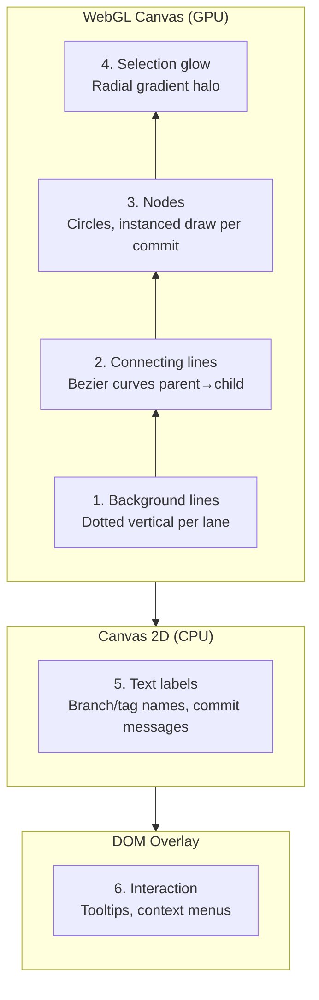

# Commit Graph Layout Algorithm

## Core Concept

A Git commit history is a **directed acyclic graph (DAG)**. Visualization maps this DAG onto a 2D grid:

- **Y-axis** — time / topological order (newer commits at top, older at bottom)
- **X-axis** — lanes, each active branch occupies one column

## Lane Assignment Algorithm

Inspired by Git's own `git log --graph` output, the algorithm processes commits in reverse topological order (newest first) and assigns each commit to a lane column. The core challenge is minimizing lane count while ensuring no two simultaneous branches overlap visually.

### Approach

1. Process commits newest-to-oldest.
2. For each commit, determine its lane from its children's lane assignments — prefer reusing existing lanes to minimize column count.
3. When a merge occurs (one commit reached by multiple parents), the outgoing lanes converge into a single lane after the merge point.
4. When a branch diverges, a new lane is allocated and the old lane is freed once all commits on it have been processed.
5. Row assignment is straightforward: the _i_-th commit in topological order gets row _i_.

The result is a compact layout with no lane overlaps, where each branch trace is a continuous vertical or diagonal path.

## WebGL + Canvas 2D Hybrid Rendering

### Coordinate Flow

```
Rust backend: computes (lane, row) per commit
       → sends to frontend as coordinate arrays
       → frontend maps into WebGL vertex buffers + Canvas 2D text
       → DOM overlay handles interaction (click, hover, tooltip)
```

### Render Layers (bottom to top)



1. **Background lines** (WebGL) — dotted vertical per lane, `gl.LINES` + stipple pattern
2. **Connecting lines** (WebGL) — bezier curves tessellated into triangle strips
3. **Nodes** (WebGL) — filled circles via instanced rendering, 1 draw call for all visible commits
4. **Selection glow** (WebGL) — oversized circle + fragment shader radial gradient
5. **Text labels** (Canvas 2D) — high-quality `fillText` for branch names and commit messages
6. **Interaction** (DOM) — transparent overlay for click hit-testing, hover, tooltips

### Color Palette

Each branch lane is assigned a color from a cycling palette to visually distinguish parallel lines of development. The palette is chosen for good contrast against both light and dark backgrounds.

### Virtual Scrolling

Only commits within the viewport (plus a small overscan buffer above and below) have their vertex data uploaded to the GPU. The visible range is recomputed on each scroll frame. WebGL instanced rendering draws all 200+ visible nodes in a single draw call, enabling smooth 60fps scrolling even for repositories with 100K+ commits. Canvas 2D text is drawn only for commits with visible branch/tag labels.

## Interactions

| Interaction | Description |
|-------------|-------------|
| Scroll | Virtual scrolling with WebGL canvas translate |
| Zoom | WebGL projection matrix scale; row height adjusts proportionally |
| Select commit | CPU hit-test (distance check against node positions, ~200 visible nodes) |
| Hover highlight | Re-upload hovered node with highlight color to WebGL buffer |
| Pan/Drag | WebGL canvas translate with boundary clamping |
| Tooltip / context menu | DOM overlay positioned via `getBoundingClientRect`

## Performance Targets

| Scenario | Target |
|----------|--------|
| < 100K commits | Smooth 60fps scrolling |
| Initial load (500 commits) | < 200ms |
| Incremental load (500 commits) | < 100ms |
| Memory usage (100K commits) | < 200MB |
