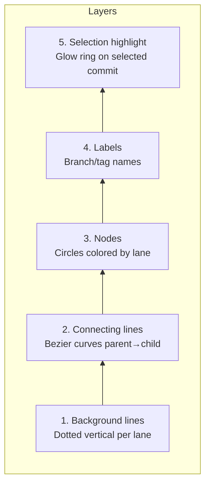

# Commit Graph Layout Algorithm

## Core Concept

A Git commit history is a **directed acyclic graph (DAG)**. Visualization maps this DAG onto a 2D grid:

- **Y-axis** = time/topological order (newer commits at top, older at bottom)
- **X-axis** = lanes, each active branch occupies one lane

## Algorithm: Lane Assignment

Based on Git's native `git log --graph` algorithm from `graph.c`, rewritten in Rust.

### Data Structures

```rust
// src-tauri/src/git/graph.rs
pub struct GraphState {
    pub nodes: Vec<CommitNode>,  // See git-engine.md for CommitNode definition
    pub edges: Vec<Edge>,
    pub max_lanes: u32,
}

pub struct ColumnState {
    pub active_columns: Vec<Column>,
    pub column_mapping: Vec<Option<String>>,
}

pub struct Column {
    pub id: u32,
    pub color: u32,   // Palette index
    pub commit_count: u32,
}
```

### Algorithm Flow

```
Input: Topologically sorted commit list (newest → oldest)
Output: (x=column, y=row, lane_count) for each commit

1. Initialize:
   - columns = [] (empty lane list)
   - next_free_column = 0

2. For each commit (newest to oldest):
   a. Find the commit's child nodes (parents in git terms)
   b. If the commit already has a lane assignment, keep it
   c. If the commit has no lane:
      - Among its children's lanes, pick the leftmost free lane
      - If no free lane, allocate a new lane (next_free_column++)
   d. For each child node:
      - If child has no lane, occupy the current lane
      - If the same child is referenced by multiple parents (merge scenario),
        allocate a new lane
   e. Release lanes that are no longer referenced:
      - A lane is released once all children on that lane have been processed

3. Y-axis assignment:
   - The i-th commit (topological order) → y = i * ROW_HEIGHT
```

### Color Palette

Each lane is assigned a color, cycling through a 12-color palette:

```rust
const LANE_COLORS: &[u32] = &[
    0xE6194B, 0x3CB44B, 0xFFE119, 0x4363D8,
    0xF58231, 0x911EB4, 0x42D4F4, 0xF032E6,
    0xBFEF45, 0xFABED4, 0x469990, 0xDCBEFF,
];
```

## Canvas Rendering Strategy

### Rendering Pipeline


### Render Layers (bottom to top)



1. **Background lines**: a dotted vertical line per lane as branch trace
2. **Connecting lines**: bezier curves between parent and child
3. **Nodes**: commit dots (circles), colored by lane
4. **Labels**: branch names, tag names (next to corresponding commit)
5. **Selection highlight**: glow ring around the currently selected commit

### Edge Drawing

```
parent (x1, y1) → child (x2, y2)

When x1 == x2 (same lane):
  Straight line connection

When x1 != x2 (across lanes):
  Cubic bezier curve
  Control points: (x1, (y1+y2)/2), (x2, (y1+y2)/2)
```

### Virtual Scrolling

```typescript
const VISIBLE_RANGE = {
  start: Math.floor(scrollTop / ROW_HEIGHT),
  end: Math.ceil((scrollTop + viewportHeight) / ROW_HEIGHT),
}

const visibleCommits = commits.slice(
  Math.max(0, VISIBLE_RANGE.start - OVERSACAN),
  Math.min(commits.length, VISIBLE_RANGE.end + OVERSACAN),
)
```

## Interactions

| Interaction | Implementation |
|-------------|----------------|
| Scroll | Virtual scrolling + Canvas translate |
| Zoom | Canvas scale + adjust ROW_HEIGHT |
| Select commit | Canvas hit test (reverse coordinate calculation) |
| Hover highlight | mousemove → nearest node → highlight entire branch line |
| Pan/drag | Canvas translate + boundary clamping |

## Performance Targets

| Scenario | Target |
|----------|--------|
| < 100K commits | Smooth 60fps scrolling |
| Initial load (500 commits) | < 200ms |
| Incremental load (500 commits) | < 100ms |
| Memory usage (100K commits) | < 200MB |
